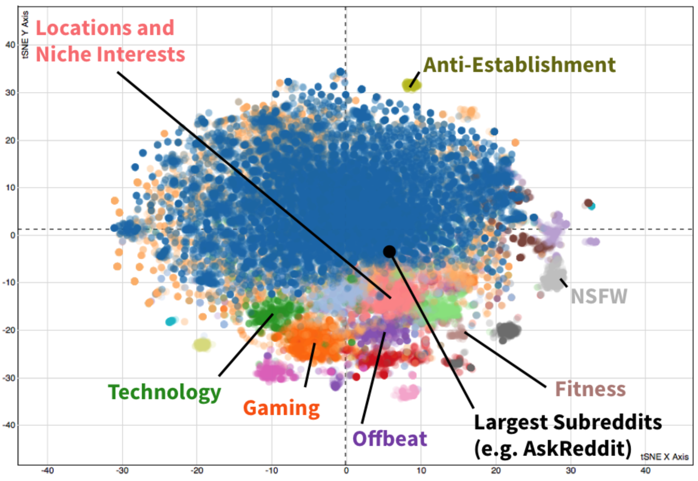

# Project 3: Community learning

In this project, you will be doing unsupervised learning on an online dataset.

This can be done either through network embedding and clustering or through NLP word/sentence/paragraph/etc. embedding of the text in the dataset and clustering on this.

This project is **fully open-ended**, I encourage you to be creative.

## Requirements

- You generate a new dataset from an online API or scraping. No pre-made datasets!
- You discover underlying clusters (social communities, market patterns, etc.) using unsupervised learning tools we've seen in class (clustering, dimensionality reduction, pre-trained word embeddings, network embedding, etc.)
- Produce a visualization in 2d or 3d of the data (using dimensionality reduction) with the clusters you found tagged. See reddit example below.
- Analyze the produced clusters and use them to provide a short exposition (5-10min) of what you found. One team member can present if desired

Reddit example visualization:

## Interesting API examples

- [Pushshift (reddit)](https://reddit-api.readthedocs.io/en/latest/)
- [Twitter API](https://developer.twitter.com/en/docs/twitter-api)
- [IG Graph API](https://developers.facebook.com/docs/instagram-api/#get-started)
- [Tumblr](https://www.tumblr.com/docs/en/api/v2)
- [Pinterest](https://www.pinterest.ca/login/?next=http%3A%2F%2Fdevelopers.pinterest.com%2Fapi_docs%2F)
- [eBay](https://developer.ebay.com/common/api/)

**You don't have to do it at a large scale**

The data for these sort of projects can run very large if you let them, making the enterprise difficult.

You can limit yourself to samples of the communities you're looking at rather than the entire thing.

If you want to work at a larger scale, reach out to me and I'll help you with tools for larger graphs or larger text datasets.